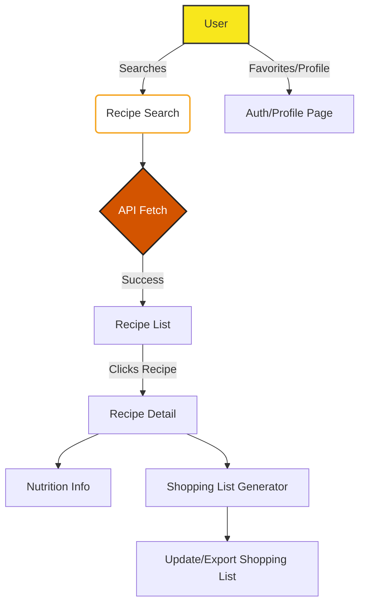

# CookEase Implementation Plan

## Project Overview

CookEase is designed as a modern, user-friendly web platform for cooking enthusiasts. It will offer users a streamlined experience for searching recipes, getting step-by-step instructions, checking nutrition information, and maintaining shopping lists. The application will integrate with external APIs such as Spoonacular, TheMealDB, and OpenAI to deliver a rich, personalized experience. Major expected features include:

- Recipe search by ingredients or dish name
- Step-by-step cooking guidance
- Display of nutritional information (calories, macros, dietary tags)
- Shopping list generator from recipe ingredients
- Light/dark theme toggling
- Responsive design for mobile and desktop
- Clean UI with easy navigation (categories, favorites, history, search)
- Tailwind CSS styling
- Secure authentication and user profile management
- API response caching, robust error handling, and secure key management

---

## Architectural Overview

The CookEase application will be built as a single-page React application (SPA), currently scaffolded with create-react-app (CRA). Although Next.js was initially planned (and migration should remain a consideration), the present setup is CRA-based.

The architecture will focus on modular, reusable components organized under dedicated directories. Context Providers or custom hooks will be utilized for cross-cutting concerns such as theme state and authentication. API interaction logic will be encapsulated within service modules, and in-memory or persistent caching will be implemented to optimize performance.

### Component Structure (Proposed)

```
src/
  components/
    MainContainer/
    Sidebar/
    Navigation/
    RecipeSearch/
    RecipeList/
    RecipeDetail/
    ShoppingList/
    Favorites/
    Profile/
    Auth/
    ThemeToggle/
    LoadingIndicator/
    ErrorDisplay/
  hooks/
    useTheme.js
    useAuth.js
    useApi.js
    useCache.js
  services/
    apiRecipes.js
    apiNutrition.js
    apiAuth.js
    cacheService.js
  utils/
    keyManager.js
    logging.js
  styles/
    (Tailwind configuration and custom utilities)
  App.js
  index.js
```

- **Theme & Context Providers:** Core contexts (e.g., ThemeContext, AuthContext) will be defined at the top level for state propagation.
- **Routing:** React Router will manage navigation between functional pages. If Next.js migration occurs, native routing will supersede.
- **API Services:** Service modules will standardize API calls and centralize response/error handling and caching logic.
- **State Management:** Favor React’s Context API and hooks over third-party state management (for simplicity, given the MVP scope).

---

## Step-by-Step Implementation Plan

### 1. Project Architecture and Component Scaffold
- Define and create the core folders for components, hooks, services, and utilities.
- Scaffold initial components as stubs for incremental development.
- Outline component hierarchy, focusing on the MainContainer layout and sidebar-navigation structure.

### 2. Integrate Tailwind CSS
- Install and configure Tailwind CSS following CRA compatibility guidelines.
- Migrate from custom CSS to Tailwind classes for layout and visual styling.
- Remove redundant or conflicting CSS after conversion.

### 3. Layout & Navigation
- Build a responsive sidebar and main content area as distinct components.
- Introduce a navigation bar with links/buttons to sections: categories, favorites, search, history, user profile, etc.
- Ensure accessibility (e.g., aria-labels, tab navigation).

### 4. Theme Management (Light/Dark Mode)
- Implement a ThemeToggle component.
- Create ThemeContext (with localStorage persistence for user preference).
- Apply theme classes using Tailwind configurations or CSS variables for both modes.
- Thoroughly test toggling and theming for all components.

### 5. Routing Setup
- Integrate React Router (or evaluate migration to Next.js routing if scope changes).
- Define routes/pages: Home (search), RecipeDetail, ShoppingList, Favorites, Profile, Auth.
- Use nested routes for sub-sections if necessary.

### 6. Recipe Search & List
- Design the RecipeSearch UI for input by name/ingredient.
- Implement logic to call and consume Spoonacular/TheMealDB APIs, with API key/config pulled from secure storage.
- Present loading, empty, and error states.
- Display results in a responsive RecipeList grid with clickable RecipeCard previews.

### 7. Recipe Detail Features
- Fetch and display full instructions for a selected recipe.
- Show detailed nutrition info, including calories, macros, and dietary tags.
- Provide an “Add All Ingredients to Shopping List” action.

### 8. Shopping List Management
- Enable shopping list generation from chosen recipes.
- UI for checking off, clearing, or exporting lists.
- Consider persistent storage (localStorage or future backend) for shopping list state.

### 9. Auth & User Profile
- Add frontend-only authentication for MVP (sign up, sign in, sign out).
- Profile page to show/manage favorites and history linked to the user.
- Protect user routes with authentication checks.

### 10. Loading, Error Handling, Logging
- Integrate a consistent loading indicator (spinner, skeleton, etc.).
- Catch and display user-friendly API/UI error messages.
- Incorporate simple logging utility to debug client behavior (can be removed/extended for prod).

### 11. API Key Security
- Store API keys in `.env` and **never include sensitive info in source control**.
- Access keys through service modules, do not inline in components.

### 12. Client-Side Caching
- Implement in-memory caching in service utilities, or browser storage (localStorage/IndexedDB) for frequent queries.
- Cache invalidation rules must be established for freshness.

### 13. Visual Verification
- Conduct manual or automated UI/UX checks for mobile and desktop.
- Verify clarity, responsiveness, theme-switching, and strategic error scenarios.

---

## Issues & Special Observations

- **Framework mismatch:** The project currently uses CRA. If SEO, SSR, or advanced routing is needed, consider migration to Next.js sooner rather than later to avoid double work.
- **No backend/persistence:** All user data and lists stored in-memory or local browser storage unless backend is later added.
- **Tailwind CSS not yet integrated:** Ensuring visual consistency is a critical milestone.
- **Componentization:** No modular structure so far, so all core features must be built from scratch.
- **Sensitive config:** Keep all environment variables in `.env`, and check `.gitignore` to prevent leakage.
- **Testing & Documentation:** It is advisable to write basic tests and update this plan or code-level docs as you build.
- **Scope Management:** Focus on MVP first (search, instructions, shopping list, light/dark mode), then incrementally layer in authentication, favorites, profile, and OpenAI enhancements.

---

## Recommendations

- **Early Tailwind integration and component scaffold** will streamline development.
- **Prioritize page routing and state/context setup** to establish a solid project foundation.
- **Periodic refactoring** as features are layered in will avoid cruft and maintain scale.
- **MVP focus:** Launch with core features operational, gather feedback, and refine advanced capabilities post-launch.
- If Next.js is adopted, plan a dedicated migration sprint early to avoid rework.
- Keep security, usability, and maintainability at the forefront throughout development.
- Revisit this plan after each major milestone for adjustment and tracking.

---

## Mermaid Diagram: High-level Flow



---

This plan should serve as a living document—update as decisions, APIs, file structures, or priorities evolve throughout development. For new contributors or reviewers, this also provides an at-a-glance reference for CookEase’s direction and structure.
